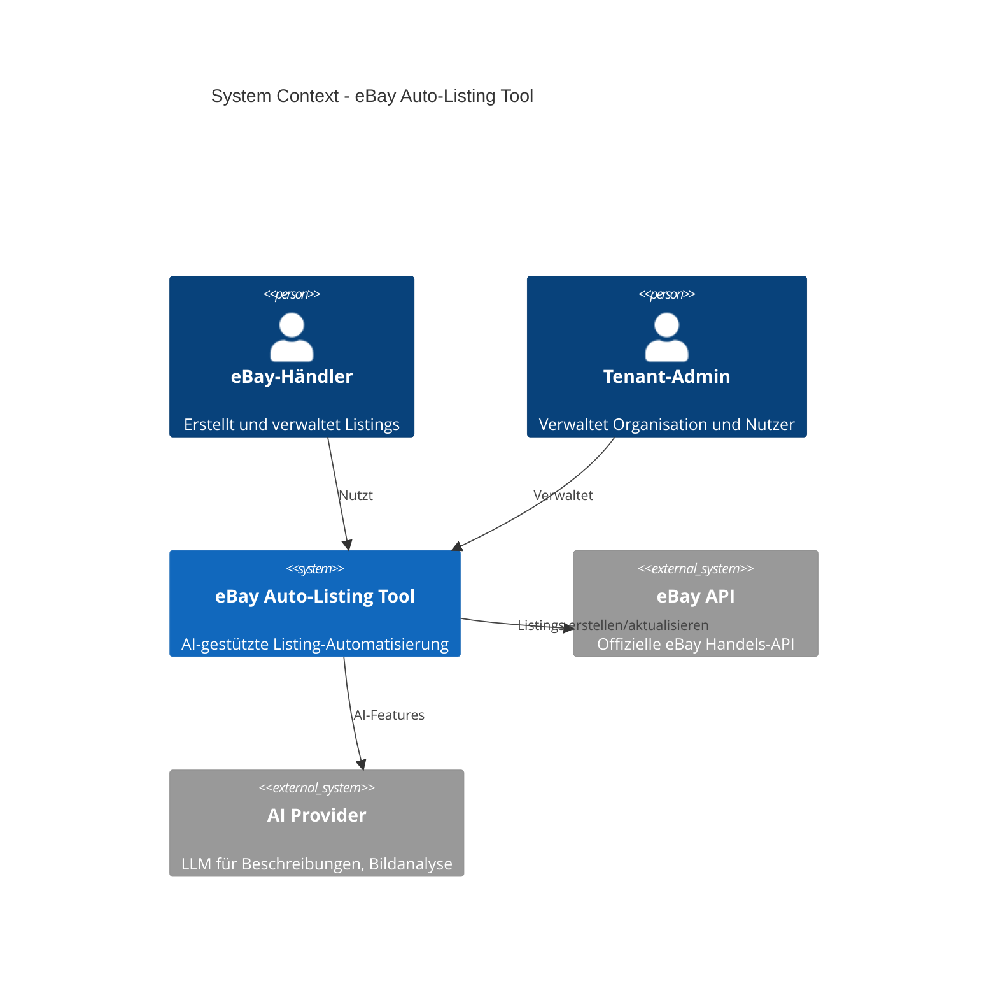
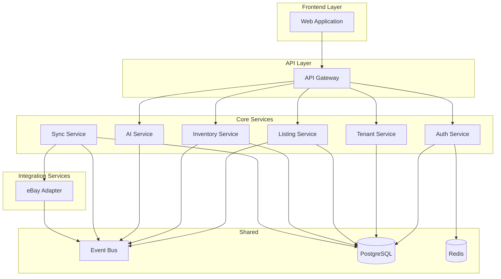
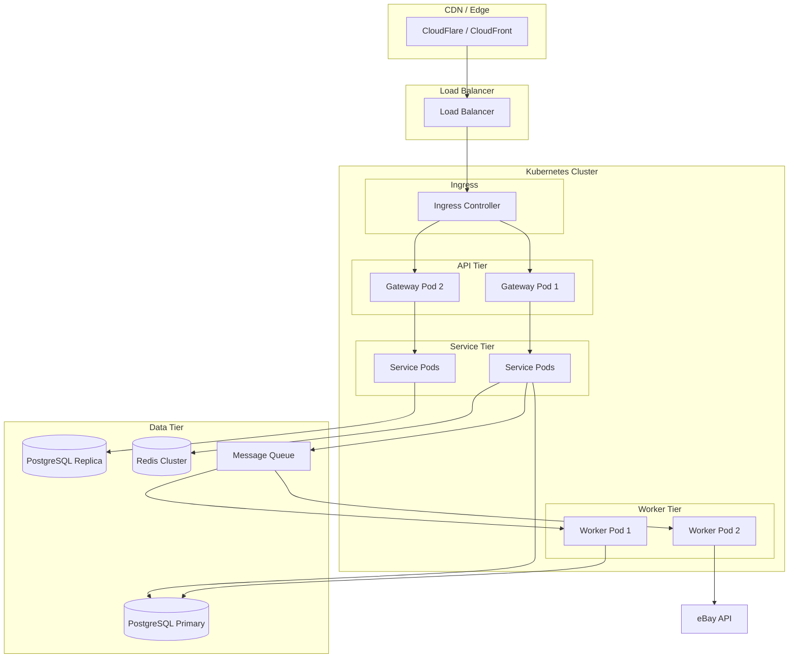

# eBay Auto-Listing Tool – Systemarchitektur

## 1. Architektur-Übersicht

### 1.1 Vision
Ein SaaS-fähiges, AI-gestütztes eBay-Listing-Automatisierungstool für Händler mit Multi-Tenancy, skalierbarer Event-Architektur und klarer Service-Trennung.

### 1.2 Architekturprinzipien
| Prinzip | Beschreibung |
|---------|--------------|
| **Modularität** | Jeder Service hat eine einzige Verantwortung (SRP) |
| **Lose Kopplung** | Kommunikation über Events und definierte APIs |
| **Hohe Kohäsion** | Domänenlogik bleibt innerhalb der Service-Grenzen |
| **SaaS-Ready** | Multi-Tenancy, Subscription-Management, Usage-Tracking |
| **API-First** | Alle Schnittstellen als OpenAPI/JSON spezifiziert |

### 1.3 High-Level Systemkontext

### 1.4 Technologie-Stack (Empfehlung)

| Schicht | Technologie | Begründung |
|---------|-------------|------------|
| **Frontend** | React/Next.js oder Vue/Nuxt | SPA/SSR, TypeScript, Komponenten |
| **API Gateway** | Kong / AWS API Gateway | Rate-Limiting, Auth, Routing |
| **Backend Services** | Node.js (NestJS) oder Python (FastAPI) | Async, Ökosystem |
| **Message Broker** | RabbitMQ / AWS SQS | Event-Driven, Zuverlässigkeit |
| **Datenbank** | PostgreSQL | ACID, JSONB, Skalierbarkeit |
| **Cache** | Redis | Sessions, Rate-Limits, Caching |
| **Object Storage** | S3/MinIO | Bilder, Dokumente |
| **AI Integration** | OpenAI/Anthropic API | LLM für Beschreibungen |

---

## 2. Service-Landschaft

### 2.1 Bounded Contexts

### 2.2 Service-Matrix

| Service | Verantwortung | Datenbesitz | Events (Out) | Events (In) |
|---------|---------------|-------------|--------------|-------------|
| **Auth Service** | Authentifizierung, Autorisierung, Sessions | Users, Sessions, Permissions | UserCreated, SessionRevoked | - |
| **Tenant Service** | Multi-Tenancy, Organisationen, Subscriptions | Tenants, Plans, Billing | TenantCreated, PlanChanged | - |
| **Listing Service** | Listing-Erstellung, -Bearbeitung, -Workflows | Listings, Templates | ListingCreated, ListingPublished | InventorySynced |
| **Inventory Service** | Produktdaten, Varianten, Bestände | Products, Variants, Stock | InventorySynced, StockUpdated | - |
| **AI Service** | Beschreibungen, Bildanalyse, Kategorisierung | AI-Jobs, Prompts | AIJobCompleted | ListingDraftCreated |
| **Sync Service** | eBay-API-Integration, Bidirektionale Synchronisation | Sync-State, eBay-Mappings | ListingPublished, SyncCompleted | ListingApproved |
| **eBay Adapter** | eBay API-Aufrufe, OAuth, Retry-Logik | - (stateless) | - | - |

---

## 3. Deployment-Architektur

---

## 4. Nächste Dokumente

- [01-SERVICE-BOUNDARIES.md](./01-SERVICE-BOUNDARIES.md) – Detaillierte Service-Grenzen
- [02-API-CONTRACTS.md](./02-API-CONTRACTS.md) – REST/Event-Interfaces
- [03-DATABASE-SCHEMA.md](./03-DATABASE-SCHEMA.md) – Datenmodell
- [04-EVENT-FLOWS.md](./04-EVENT-FLOWS.md) – Event-Sequenzen
- [05-SECURITY-SCALABILITY.md](./05-SECURITY-SCALABILITY.md) – NFRs
