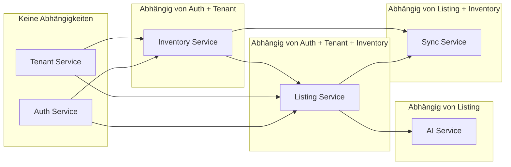

# Service-Grenzen und Abhängigkeiten

## 1. Abhängigkeitsregeln

### 1.1 Dependency Inversion
- **Kein Service** darf direkt die Datenbank eines anderen Services lesen/schreiben
- **Kein Service** darf synchron andere Services aufrufen (außer über API Gateway für User-Requests)
- **Kommunikation**: Async über Events, Sync nur über definierte API-Contracts

### 1.2 Abhängigkeitsgraph

---

## 2. Service-Spezifikationen

### 2.1 Auth Service

| Attribut | Wert |
|----------|------|
| **Bounded Context** | Identity & Access Management |
| **Port** | 3001 (intern) |
| **Datenbesitz** | users, sessions, refresh_tokens, roles, permissions |

**Verantwortlichkeiten:**
- JWT-Erstellung und -Validierung
- OAuth2/OIDC (Login mit Google, eBay)
- Session-Management
- RBAC (Role-Based Access Control)
- Tenant-User-Zuordnung

**Nicht verantwortlich:**
- Tenant-Metadaten (→ Tenant Service)
- Listing-Berechtigungen (→ Listing Service prüft über Auth)

**Schnittstellen:**
- `POST /auth/login`
- `POST /auth/refresh`
- `POST /auth/logout`
- `GET /auth/me`
- `POST /auth/oauth/callback`

---

### 2.2 Tenant Service

| Attribut | Wert |
|----------|------|
| **Bounded Context** | Multi-Tenancy & Billing |
| **Port** | 3002 (intern) |
| **Datenbesitz** | tenants, plans, subscriptions, usage_records |

**Verantwortlichkeiten:**
- Tenant (Organisation) CRUD
- Subscription- und Plan-Verwaltung
- Usage-Tracking (Listings/Monat, API-Calls)
- Feature-Flags pro Plan
- Billing-Integration (Stripe)

**Nicht verantwortlich:**
- User-Zuordnung (→ Auth Service)
- Listing-Limits (→ prüft Tenant Service via API)

**Schnittstellen:**
- `GET/POST/PATCH /tenants`
- `GET /tenants/:id/usage`
- `GET /tenants/:id/subscription`
- `POST /tenants/:id/check-limit`

---

### 2.3 Inventory Service

| Attribut | Wert |
|----------|------|
| **Bounded Context** | Produktdaten & Bestand |
| **Port** | 3003 (intern) |
| **Datenbesitz** | products, variants, stock_levels, categories |

**Verantwortlichkeiten:**
- Produkt-Masterdaten
- Varianten (Größe, Farbe etc.)
- Bestandsführung
- Kategorien (intern + eBay-Mapping)
- Import (CSV, API)

**Nicht verantwortlich:**
- Listing-Texte (→ Listing Service)
- eBay-Sync (→ Sync Service)

**Schnittstellen:**
- `CRUD /products`
- `CRUD /products/:id/variants`
- `PATCH /products/:id/stock`
- `GET /categories`
- `POST /import`

---

### 2.4 Listing Service

| Attribut | Wert |
|----------|------|
| **Bounded Context** | Listing-Lifecycle |
| **Port** | 3004 (intern) |
| **Datenbesitz** | listings, listing_templates, listing_history |

**Verantwortlichkeiten:**
- Listing-Erstellung (Draft → Review → Published)
- Template-Verwaltung
- Workflow-Orchestrierung
- Verknüpfung Product ↔ Listing
- AI-Anfragen triggern (Event)

**Nicht verantwortlich:**
- AI-Generierung (→ AI Service)
- eBay-Publish (→ Sync Service)
- Produktdaten (→ Inventory Service)

**Schnittstellen:**
- `CRUD /listings`
- `POST /listings/:id/approve`
- `POST /listings/:id/publish`
- `CRUD /templates`
- `POST /listings/:id/generate-ai` (triggert Event)

---

### 2.5 AI Service

| Attribut | Wert |
|----------|------|
| **Bounded Context** | AI-Features |
| **Port** | 3005 (intern) |
| **Datenbesitz** | ai_jobs, prompts, model_configs |

**Verantwortlichkeiten:**
- Beschreibungs-Generierung (LLM)
- Bildanalyse (Kategorisierung, Tags)
- Titel-Optimierung
- Job-Queue für asynchrone AI-Aufrufe
- Prompt-Templates

**Nicht verantwortlich:**
- Listing-Speicherung (→ Listing Service)
- Produktdaten (→ erhält via Event-Payload)

**Schnittstellen:**
- `POST /ai/generate-description`
- `POST /ai/analyze-images`
- `GET /ai/jobs/:id`
- `POST /ai/jobs/:id/cancel`

---

### 2.6 Sync Service

| Attribut | Wert |
|----------|------|
| **Bounded Context** | eBay-Integration |
| **Port** | 3006 (intern) |
| **Datenbesitz** | sync_state, ebay_mappings, ebay_credentials |

**Verantwortlichkeiten:**
- eBay OAuth & Token-Refresh
- Listing → eBay Publish
- Bestands-Sync (eBay ↔ System)
- Webhook-Handler (eBay Notifications)
- Retry & Idempotenz

**Nicht verantwortlich:**
- Listing-Inhalte (→ Listing Service)
- Produktdaten (→ Inventory Service)

**Schnittstellen:**
- `POST /sync/publish`
- `GET /sync/status/:listingId`
- `POST /sync/webhook/ebay`
- `GET /sync/credentials`

---

## 3. Abhängigkeits-Tabelle (Dependencies)

| Consumer | Provider | Art | Daten |
|----------|----------|-----|------|
| API Gateway | Auth Service | Sync (JWT validieren) | Token |
| API Gateway | Tenant Service | Sync | Tenant-ID, Plan |
| Listing Service | Inventory Service | Sync (API) | Product, Variants |
| Listing Service | Tenant Service | Sync (API) | Limit-Check |
| AI Service | Listing Service | Async (Event) | Listing-Draft |
| Sync Service | Listing Service | Async (Event) | Listing-Approved |
| Sync Service | Inventory Service | Async (Event) | Stock-Update |
| Sync Service | eBay Adapter | Sync (Library) | API-Calls |

---

## 4. Shared Kernel (Gemeinsame Konzepte)

Folgende Konzepte sind **nicht** in einem Service gekapselt, sondern als gemeinsame Definitionen:

| Konzept | Definition | Verwendung |
|---------|------------|------------|
| **TenantId** | UUID | Alle Services (Header: X-Tenant-Id) |
| **UserId** | UUID | Auth, alle Services |
| **ListingId** | UUID | Listing, AI, Sync |
| **ProductId** | UUID | Inventory, Listing |
| **Event-Format** | CloudEvents 1.0 | Event Bus |
| **Fehlercodes** | EBAY-XXX | Alle Services |

Diese werden in einem **Shared Library** Paket bereitgestellt (z.B. `@ebay-tool/shared-types`).
