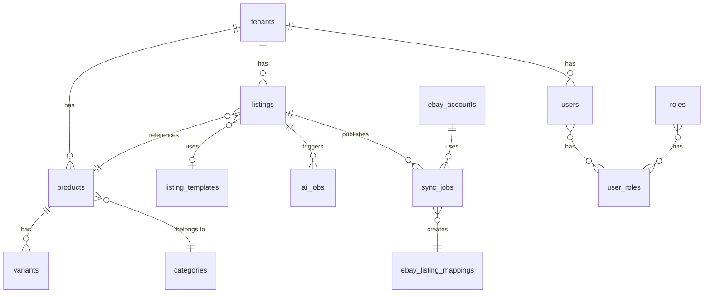

# Datenbank-Schema

## 1. Prinzipien

### 1.1 Database-per-Service
Jeder Service besitzt seine eigene Datenbank (Schema oder physische DB). Kein Cross-Service-DB-Zugriff.

### 1.2 Schema-Übersicht

| Service | Schema/DB | Technologie |
|---------|-----------|-------------|
| Auth | auth | PostgreSQL |
| Tenant | tenant | PostgreSQL |
| Inventory | inventory | PostgreSQL |
| Listing | listing | PostgreSQL |
| AI | ai | PostgreSQL |
| Sync | sync | PostgreSQL |

### 1.3 Gemeinsame Konventionen
- **IDs**: UUID v4, Primärschlüssel
- **Timestamps**: `created_at`, `updated_at` (UTC)
- **Soft Delete**: `deleted_at` (nullable)
- **Tenant-Isolation**: `tenant_id` in allen tenant-spezifischen Tabellen

---

## 2. Auth Schema

```sql
-- users
CREATE TABLE users (
  id UUID PRIMARY KEY DEFAULT gen_random_uuid(),
  tenant_id UUID NOT NULL,
  email VARCHAR(255) NOT NULL,
  password_hash VARCHAR(255),
  email_verified_at TIMESTAMPTZ,
  created_at TIMESTAMPTZ DEFAULT NOW(),
  updated_at TIMESTAMPTZ DEFAULT NOW(),
  deleted_at TIMESTAMPTZ,
  UNIQUE(tenant_id, email)
);

-- sessions
CREATE TABLE sessions (
  id UUID PRIMARY KEY DEFAULT gen_random_uuid(),
  user_id UUID NOT NULL REFERENCES users(id),
  refresh_token_hash VARCHAR(255) NOT NULL,
  expires_at TIMESTAMPTZ NOT NULL,
  ip_address INET,
  user_agent TEXT,
  created_at TIMESTAMPTZ DEFAULT NOW(),
  revoked_at TIMESTAMPTZ
);

-- roles
CREATE TABLE roles (
  id UUID PRIMARY KEY DEFAULT gen_random_uuid(),
  tenant_id UUID NOT NULL,
  name VARCHAR(100) NOT NULL,
  permissions JSONB DEFAULT '[]',
  UNIQUE(tenant_id, name)
);

-- user_roles
CREATE TABLE user_roles (
  user_id UUID REFERENCES users(id),
  role_id UUID REFERENCES roles(id),
  PRIMARY KEY (user_id, role_id)
);

-- Indexes
CREATE INDEX idx_users_tenant ON users(tenant_id);
CREATE INDEX idx_sessions_user ON sessions(user_id);
CREATE INDEX idx_sessions_expires ON sessions(expires_at);
```

---

## 3. Tenant Schema

```sql
-- tenants
CREATE TABLE tenants (
  id UUID PRIMARY KEY DEFAULT gen_random_uuid(),
  name VARCHAR(255) NOT NULL,
  slug VARCHAR(100) NOT NULL UNIQUE,
  plan VARCHAR(50) NOT NULL DEFAULT 'starter',
  subscription_status VARCHAR(50) DEFAULT 'active',
  stripe_customer_id VARCHAR(255),
  stripe_subscription_id VARCHAR(255),
  settings JSONB DEFAULT '{}',
  created_at TIMESTAMPTZ DEFAULT NOW(),
  updated_at TIMESTAMPTZ DEFAULT NOW(),
  deleted_at TIMESTAMPTZ
);

-- plans (Referenz)
CREATE TABLE plans (
  id VARCHAR(50) PRIMARY KEY,
  name VARCHAR(100) NOT NULL,
  limits JSONB NOT NULL,
  features JSONB DEFAULT '[]'
);

-- usage_records
CREATE TABLE usage_records (
  id UUID PRIMARY KEY DEFAULT gen_random_uuid(),
  tenant_id UUID NOT NULL REFERENCES tenants(id),
  resource_type VARCHAR(50) NOT NULL,
  resource_count INTEGER NOT NULL DEFAULT 0,
  period_start DATE NOT NULL,
  period_end DATE NOT NULL,
  created_at TIMESTAMPTZ DEFAULT NOW(),
  UNIQUE(tenant_id, resource_type, period_start)
);

-- Indexes
CREATE INDEX idx_usage_tenant_period ON usage_records(tenant_id, period_start);
```

---

## 4. Inventory Schema

```sql
-- categories
CREATE TABLE categories (
  id UUID PRIMARY KEY DEFAULT gen_random_uuid(),
  tenant_id UUID NOT NULL,
  name VARCHAR(255) NOT NULL,
  parent_id UUID REFERENCES categories(id),
  ebay_category_id VARCHAR(50),
  created_at TIMESTAMPTZ DEFAULT NOW(),
  updated_at TIMESTAMPTZ DEFAULT NOW()
);

-- products
CREATE TABLE products (
  id UUID PRIMARY KEY DEFAULT gen_random_uuid(),
  tenant_id UUID NOT NULL,
  sku VARCHAR(100) NOT NULL,
  name VARCHAR(255) NOT NULL,
  description TEXT,
  category_id UUID REFERENCES categories(id),
  images JSONB DEFAULT '[]',
  attributes JSONB DEFAULT '{}',
  created_at TIMESTAMPTZ DEFAULT NOW(),
  updated_at TIMESTAMPTZ DEFAULT NOW(),
  deleted_at TIMESTAMPTZ,
  UNIQUE(tenant_id, sku)
);

-- variants
CREATE TABLE variants (
  id UUID PRIMARY KEY DEFAULT gen_random_uuid(),
  product_id UUID NOT NULL REFERENCES products(id),
  sku VARCHAR(100) NOT NULL,
  attributes JSONB DEFAULT '{}',
  stock INTEGER NOT NULL DEFAULT 0,
  price DECIMAL(12,2) NOT NULL,
  created_at TIMESTAMPTZ DEFAULT NOW(),
  updated_at TIMESTAMPTZ DEFAULT NOW(),
  UNIQUE(product_id, sku)
);

-- stock_movements (Audit)
CREATE TABLE stock_movements (
  id UUID PRIMARY KEY DEFAULT gen_random_uuid(),
  variant_id UUID NOT NULL REFERENCES variants(id),
  quantity_delta INTEGER NOT NULL,
  quantity_after INTEGER NOT NULL,
  reason VARCHAR(50),
  reference_id UUID,
  created_at TIMESTAMPTZ DEFAULT NOW()
);

-- Indexes
CREATE INDEX idx_products_tenant ON products(tenant_id);
CREATE INDEX idx_products_category ON products(category_id);
CREATE INDEX idx_variants_product ON variants(product_id);
```

---

## 5. Listing Schema

```sql
-- listing_templates
CREATE TABLE listing_templates (
  id UUID PRIMARY KEY DEFAULT gen_random_uuid(),
  tenant_id UUID NOT NULL,
  name VARCHAR(255) NOT NULL,
  title_template TEXT,
  description_template TEXT,
  default_duration VARCHAR(20),
  default_payment_methods JSONB DEFAULT '[]',
  default_shipping_options JSONB DEFAULT '[]',
  created_at TIMESTAMPTZ DEFAULT NOW(),
  updated_at TIMESTAMPTZ DEFAULT NOW(),
  deleted_at TIMESTAMPTZ
);

-- listings
CREATE TABLE listings (
  id UUID PRIMARY KEY DEFAULT gen_random_uuid(),
  tenant_id UUID NOT NULL,
  product_id UUID NOT NULL,
  template_id UUID REFERENCES listing_templates(id),
  title VARCHAR(255) NOT NULL,
  description TEXT NOT NULL,
  price DECIMAL(12,2) NOT NULL,
  quantity INTEGER NOT NULL,
  category_id VARCHAR(50),
  condition VARCHAR(50),
  images JSONB DEFAULT '[]',
  duration VARCHAR(20),
  payment_methods JSONB DEFAULT '[]',
  shipping_options JSONB DEFAULT '[]',
  status VARCHAR(50) NOT NULL DEFAULT 'draft',
  workflow_step VARCHAR(50) DEFAULT 'draft',
  created_by UUID,
  approved_by UUID,
  approved_at TIMESTAMPTZ,
  created_at TIMESTAMPTZ DEFAULT NOW(),
  updated_at TIMESTAMPTZ DEFAULT NOW(),
  deleted_at TIMESTAMPTZ
);

-- listing_history (Audit)
CREATE TABLE listing_history (
  id UUID PRIMARY KEY DEFAULT gen_random_uuid(),
  listing_id UUID NOT NULL REFERENCES listings(id),
  event_type VARCHAR(50) NOT NULL,
  payload JSONB,
  created_at TIMESTAMPTZ DEFAULT NOW()
);

-- Indexes
CREATE INDEX idx_listings_tenant ON listings(tenant_id);
CREATE INDEX idx_listings_status ON listings(status);
CREATE INDEX idx_listings_product ON listings(product_id);
CREATE INDEX idx_listings_created ON listings(created_at);
```

---

## 6. AI Schema

```sql
-- ai_jobs
CREATE TABLE ai_jobs (
  id UUID PRIMARY KEY DEFAULT gen_random_uuid(),
  tenant_id UUID NOT NULL,
  listing_id UUID,
  job_type VARCHAR(50) NOT NULL,
  status VARCHAR(50) NOT NULL DEFAULT 'pending',
  input_payload JSONB,
  output_payload JSONB,
  error_message TEXT,
  model_used VARCHAR(100),
  tokens_used INTEGER,
  created_at TIMESTAMPTZ DEFAULT NOW(),
  completed_at TIMESTAMPTZ
);

-- prompts (Konfiguration)
CREATE TABLE prompts (
  id UUID PRIMARY KEY DEFAULT gen_random_uuid(),
  tenant_id UUID,
  name VARCHAR(100) NOT NULL,
  template TEXT NOT NULL,
  variables JSONB DEFAULT '[]',
  is_system BOOLEAN DEFAULT false,
  created_at TIMESTAMPTZ DEFAULT NOW(),
  updated_at TIMESTAMPTZ DEFAULT NOW()
);

-- Indexes
CREATE INDEX idx_ai_jobs_tenant ON ai_jobs(tenant_id);
CREATE INDEX idx_ai_jobs_listing ON ai_jobs(listing_id);
CREATE INDEX idx_ai_jobs_status ON ai_jobs(status);
```

---

## 7. Sync Schema

```sql
-- ebay_accounts
CREATE TABLE ebay_accounts (
  id UUID PRIMARY KEY DEFAULT gen_random_uuid(),
  tenant_id UUID NOT NULL,
  user_id UUID NOT NULL,
  ebay_user_id VARCHAR(100),
  access_token_encrypted TEXT,
  refresh_token_encrypted TEXT,
  token_expires_at TIMESTAMPTZ,
  marketplace VARCHAR(20) DEFAULT 'EBAY_DE',
  created_at TIMESTAMPTZ DEFAULT NOW(),
  updated_at TIMESTAMPTZ DEFAULT NOW()
);

-- sync_jobs
CREATE TABLE sync_jobs (
  id UUID PRIMARY KEY DEFAULT gen_random_uuid(),
  listing_id UUID NOT NULL,
  ebay_account_id UUID NOT NULL REFERENCES ebay_accounts(id),
  status VARCHAR(50) NOT NULL DEFAULT 'queued',
  ebay_item_id VARCHAR(50),
  ebay_url TEXT,
  request_payload JSONB,
  response_payload JSONB,
  error_message TEXT,
  retry_count INTEGER DEFAULT 0,
  created_at TIMESTAMPTZ DEFAULT NOW(),
  completed_at TIMESTAMPTZ
);

-- ebay_listing_mappings
CREATE TABLE ebay_listing_mappings (
  listing_id UUID PRIMARY KEY,
  ebay_item_id VARCHAR(50) NOT NULL,
  ebay_account_id UUID NOT NULL REFERENCES ebay_accounts(id),
  last_sync_at TIMESTAMPTZ,
  created_at TIMESTAMPTZ DEFAULT NOW(),
  updated_at TIMESTAMPTZ DEFAULT NOW()
);

-- Indexes
CREATE INDEX idx_sync_jobs_listing ON sync_jobs(listing_id);
CREATE INDEX idx_sync_jobs_status ON sync_jobs(status);
CREATE INDEX idx_ebay_accounts_tenant ON ebay_accounts(tenant_id);
```

---

## 8. Entity-Relationship (Überblick)



---

## 9. Migrations-Strategie

| Tool | Verwendung |
|------|------------|
| **Flyway** / **Liquibase** | Versionierte SQL-Migrationen pro Schema |
| **Konvention** | `V{version}__{description}.sql` |
| **Reihenfolge** | auth → tenant → inventory → listing → ai → sync |

Beispiel-Struktur:
```
migrations/
  auth/
    V1__create_users.sql
    V2__add_sessions.sql
  tenant/
    V1__create_tenants.sql
  ...
```
