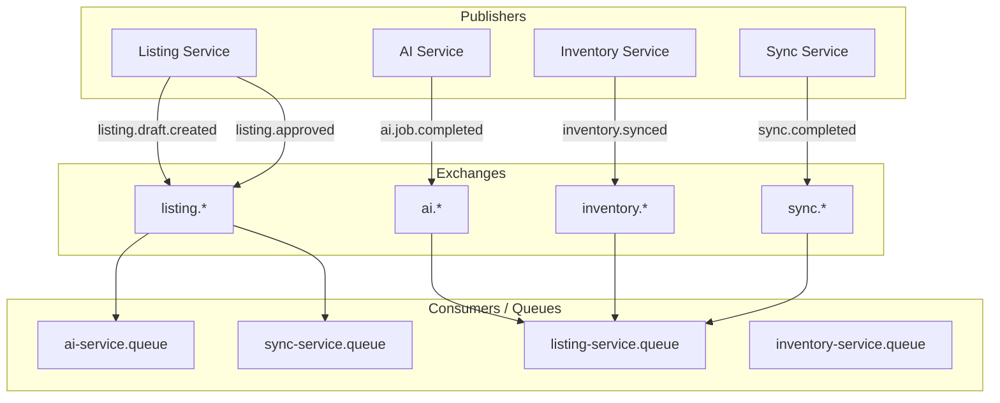
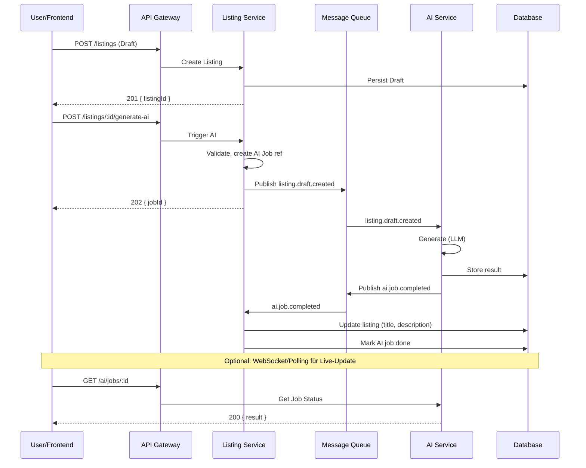
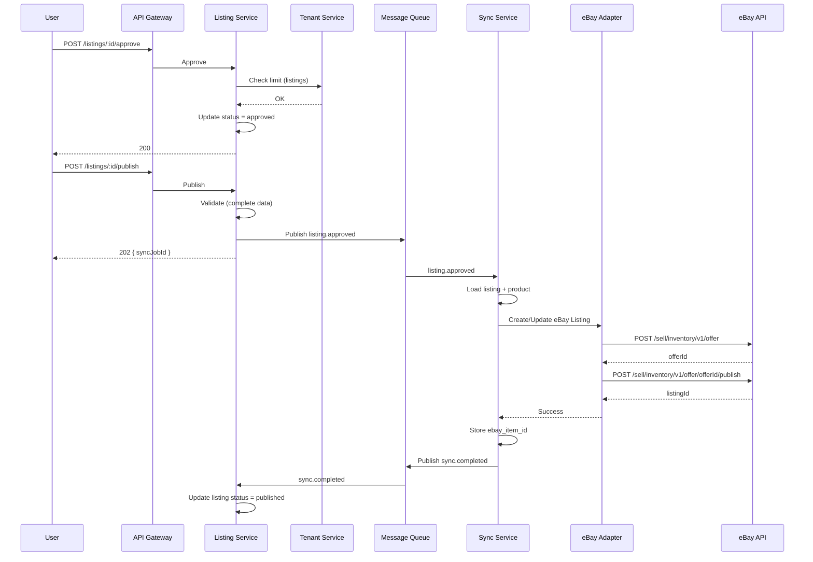
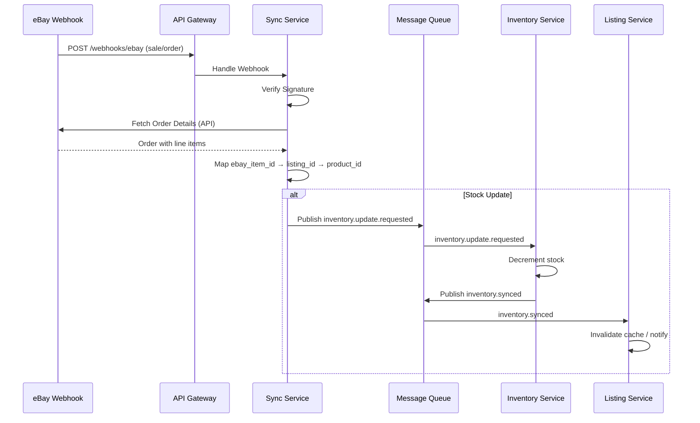
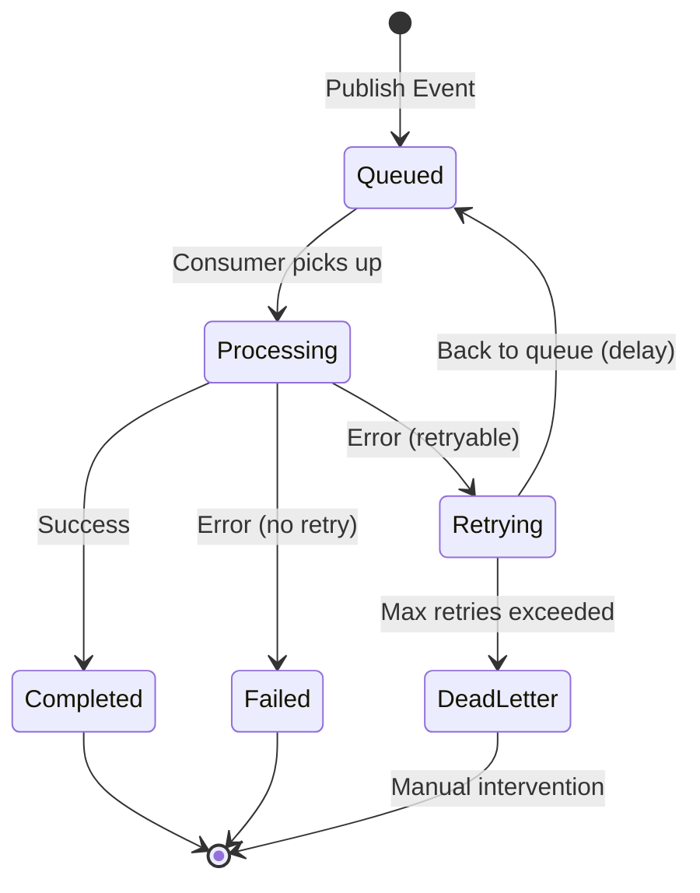
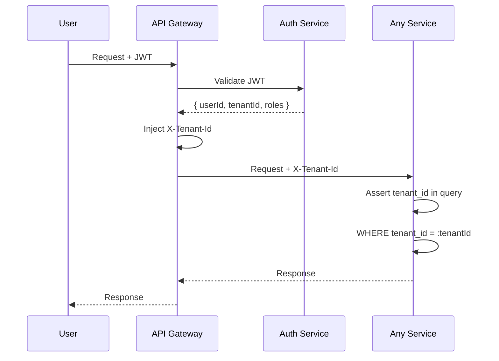

# Event-Flows und Prozess-Sequenzen

## 1. Event-Architektur

### 1.1 Event-Bus Topologie

### 1.2 Event-Typen und Routing

| Event | Publisher | Consumer(s) | Queue |
|-------|-----------|-------------|-------|
| `listing.draft.created` | Listing Service | AI Service | ai.incoming |
| `listing.approved` | Listing Service | Sync Service | sync.publish |
| `ai.job.completed` | AI Service | Listing Service | listing.ai-results |
| `inventory.synced` | Inventory Service | Listing Service | listing.inventory-updates |
| `sync.completed` | Sync Service | Listing Service | listing.sync-results |
| `sync.failed` | Sync Service | Listing Service | listing.sync-results |
| `tenant.plan.changed` | Tenant Service | Alle (broadcast) | *.tenant-updates |

---

## 2. Flow: Listing mit AI-Generierung erstellen

---

## 3. Flow: Listing zur eBay veröffentlichen

---

## 4. Flow: Bestands-Synchronisation (eBay → System)

---

## 5. Flow: Fehlerbehandlung und Retry

### Retry-Policy
| Fehlertyp | Retries | Backoff |
|-----------|---------|---------|
| eBay API 5xx | 5 | Exponential (1s, 2s, 4s, 8s, 16s) |
| eBay Rate Limit 429 | 3 | Fixed 60s |
| AI Provider Timeout | 2 | Fixed 30s |
| Validation Error | 0 | - |
| DB Deadlock | 3 | Exponential |

### Dead-Letter-Queue
- Events in DLQ werden geloggt und für manuelle Prüfung bereitgestellt
- Alert an Ops bei DLQ-Einträgen
- Kein automatisches Re-Queue ohne Review

---

## 6. Flow: Multi-Tenant-Isolation

**Regel:** Jede Datenbankabfrage MUSS `tenant_id` im WHERE-Clause enthalten (außer systemweite Abfragen).

---

## 7. Idempotenz

Für kritische Events (z.B. `listing.approved` → Publish):

| Mechanismus | Implementierung |
|-------------|-----------------|
| **Idempotency-Key** | Client sendet `X-Idempotency-Key: uuid` |
| **Storage** | Redis: `idempotency:{key}` → Response (TTL 24h) |
| **Duplicate** | Bei gleichem Key: Return cached Response, kein erneuter Publish |
| **Event-ID** | CloudEvents `id` wird in DB gespeichert, Duplikate ignoriert |

---

## 8. Event-Schema-Versionierung

Bei Breaking Changes:
- **Neue Felder**: Additiv, Consumer ignorieren unbekannte Felder
- **Entfernte Felder**: Deprecation-Period, dann neues Event `listing.draft.created.v2`
- **Routing**: Alte und neue Events parallel bis Migration abgeschlossen
