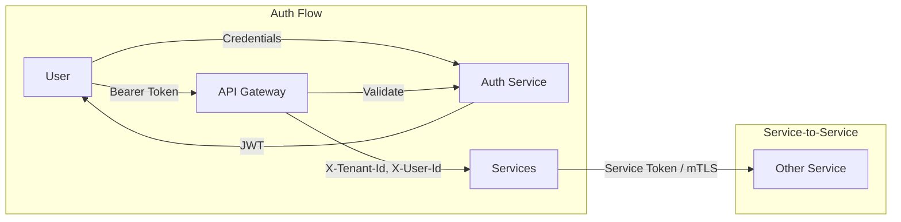
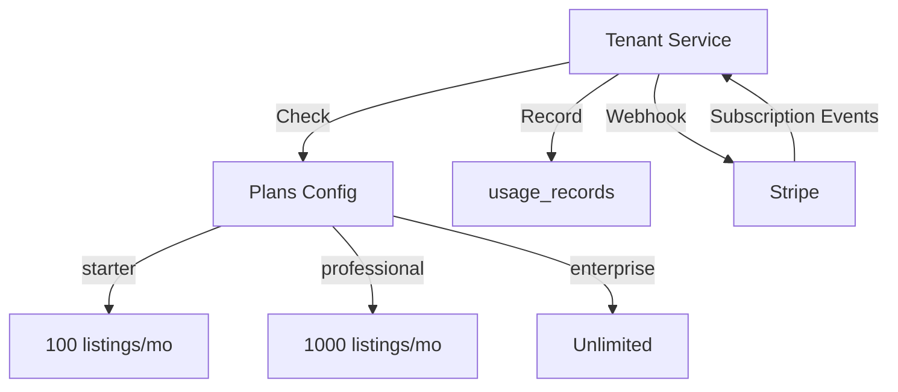
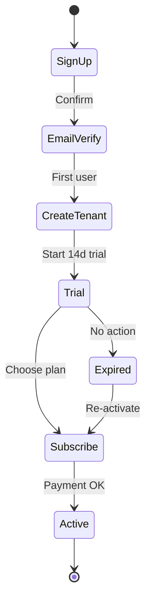

# Sicherheit, Skalierbarkeit und SaaS-Aspekte

## 1. Sicherheit

### 1.1 Bedrohungsmodell (STRIDE)

| Bedrohung | Mitigation |
|-----------|------------|
| **Spoofing** | JWT mit kurzer Lebensdauer, MFA optional, OAuth für eBay |
| **Tampering** | HTTPS, Request-Signing, HMAC für Webhooks |
| **Repudiation** | Audit-Logs (listing_history, stock_movements), Request-ID Tracing |
| **Information Disclosure** | Secrets in Vault, DB-Verschlüsselung, PII-Maskierung in Logs |
| **Denial of Service** | Rate-Limiting, Circuit Breaker, Queue-Backpressure |
| **Elevation of Privilege** | RBAC, Tenant-Isolation, Principle of Least Privilege |

### 1.2 Authentifizierung & Autorisierung

| Aspekt | Spezifikation |
|--------|---------------|
| **JWT** | RS256, 15min Access, 7d Refresh |
| **Refresh** | Rotation, One-Time-Use |
| **Service-Auth** | mTLS oder API-Key (in K8s Secret) |
| **eBay OAuth** | Token in DB verschlüsselt (AES-256-GCM) |

### 1.3 Tenant-Isolation

| Ebene | Maßnahme |
|-------|----------|
| **Datenbank** | `tenant_id` in allen Tabellen, Row-Level Security (RLS) optional |
| **API** | JWT enthält tenant_id, Gateway validiert gegen Path/Header |
| **Cache** | Key-Prefix: `{tenant_id}:{resource}` |
| **Queue** | Keine tenant-spezifischen Queues (Payload enthält tenant_id) |
| **Logs** | tenant_id nie in Klartext bei PII, nur UUID |

### 1.4 Datenschutz (DSGVO)

| Anforderung | Umsetzung |
|-------------|-----------|
| **Recht auf Löschung** | Soft-Delete + Hard-Delete-Job, Kaskade über Events |
| **Datenminimierung** | Nur notwendige Felder speichern, eBay-Token nur wenn verbunden |
| **Verschlüsselung** | TLS 1.3, DB-Encryption-at-Rest, Secrets in Vault |
| **Audit** | Wer hat wann was geändert (listing_history, user_audit) |
| **Export** | API für Datenexport (JSON) pro Tenant |

### 1.5 Sicherheits-Checkliste für Agent-Vorschläge

Bei Review von Agent-Vorschlägen prüfen:

- [ ] Keine Hardcoded Secrets, API-Keys oder Passwörter
- [ ] Alle User-Inputs validiert und escaped (SQL-Injection, XSS)
- [ ] Keine direkten DB-Zugriffe über Service-Grenzen
- [ ] tenant_id in allen tenant-spezifischen Queries
- [ ] Rate-Limiting für öffentliche Endpoints
- [ ] Sensible Daten nicht in Logs (Passwörter, Tokens, PII)

---

## 2. Skalierbarkeit

### 2.1 Horizontale Skalierung

| Komponente | Skalierungsstrategie |
|------------|----------------------|
| **API Gateway** | Stateless, mehrere Pods hinter LB |
| **Services** | Stateless, HPA (CPU/Memory), min 2 pro Service |
| **Worker (Event-Consumer)** | Mehrere Consumer pro Queue, Concurrency pro Pod |
| **PostgreSQL** | Primary + Read-Replicas, Connection Pooling (PgBouncer) |
| **Redis** | Cluster-Mode für hohe Verfügbarkeit |
| **Message Queue** | RabbitMQ Cluster / SQS (managed) |

### 2.2 Vertikale Grenzen

| Resource | Empfehlung pro Pod |
|----------|---------------------|
| **API Service** | 500m-1 CPU, 512Mi-1Gi Memory |
| **Worker** | 1 CPU, 1Gi Memory (AI/LLM höher) |
| **DB Connection Pool** | max 20 pro Service-Instanz |

### 2.3 Performance-Ziele

| Metrik | Ziel |
|--------|------|
| **API p95 Latency** | < 200ms (ohne AI) |
| **AI-Generierung** | < 30s (async) |
| **eBay Publish** | < 10s (async) |
| **Durchsatz** | 1000 req/s (Gateway) |
| **Event-Verarbeitung** | 100 events/s pro Queue |

### 2.4 Caching-Strategie

| Cache-Key | TTL | Invalidation |
|-----------|-----|--------------|
| `tenant:{id}` | 5min | On update |
| `user:{id}:permissions` | 15min | On role change |
| `product:{id}` | 1min | On update |
| `listing:{id}` | 30s | On status change |
| `plan_limits:{tenantId}` | 10min | On subscription change |

### 2.5 Skalierbarkeits-Checkliste für Agent-Vorschläge

- [ ] Kein State in Service-Instanzen (außer Cache)
- [ ] Lange Operationen asynchron (Events, Jobs)
- [ ] DB-Queries mit Indexen, keine N+1
- [ ] Externe APIs mit Timeout und Circuit Breaker
- [ ] Keine synchronen Service-zu-Service-Ketten > 2

---

## 3. SaaS-Fähigkeit

### 3.1 Multi-Tenancy-Modelle

| Modell | Beschreibung | Einsatz |
|--------|--------------|---------|
| **Shared DB, Shared Schema** | tenant_id in allen Tabellen | Standard (empfohlen) |
| **Shared DB, Separate Schema** | Schema pro Tenant | Enterprise (optional) |
| **Separate DB** | DB pro Tenant | Max. Isolation (Enterprise) |

Aktuelle Architektur: **Shared DB, Shared Schema** mit strikter tenant_id-Isolation.

### 3.2 Subscription & Billing

| Plan | Listings/Monat | Produkte | AI-Calls |
|------|----------------|----------|----------|
| Starter | 100 | 500 | 200 |
| Professional | 1000 | 5000 | 2000 |
| Enterprise | Unbegrenzt | Unbegrenzt | Unbegrenzt |

### 3.3 Feature-Flags

| Feature | Starter | Professional | Enterprise |
|---------|---------|---------------|------------|
| AI-Beschreibung | ✓ | ✓ | ✓ |
| Bildanalyse | ✗ | ✓ | ✓ |
| Bulk-Import | ✗ | ✓ | ✓ |
| API-Zugang | ✗ | ✓ | ✓ |
| Dedicated Support | ✗ | ✗ | ✓ |

Implementierung: Tenant Service liefert `features: string[]` pro Plan, Services prüfen vor Feature-Nutzung.

### 3.4 Onboarding-Flow

### 3.5 SaaS-Checkliste für Agent-Vorschläge

- [ ] Alle Features plan-abhängig prüfbar
- [ ] Usage-Tracking bei limitierten Ressourcen
- [ ] Keine tenant-übergreifenden Datenlecks
- [ ] Self-Service Onboarding (ohne manuellen Admin)
- [ ] Saubere Tenant-Löschung (Cascade, Export, Anonymisierung)

---

## 4. Konsistenz-Prüfung für Agent-Vorschläge

### 4.1 Architektur-Konsistenz

| Prüfpunkt | Frage |
|-----------|-------|
| Service-Grenze | Verletzt der Vorschlag eine Bounded Context? |
| Datenbesitz | Schreibt ein Service in die DB eines anderen? |
| Kommunikation | Sync statt Event wo Event angemessener? |
| Abhängigkeit | Neue zyklische Abhängigkeit? |

### 4.2 Sicherheits-Konsistenz

| Prüfpunkt | Frage |
|-----------|-------|
| Auth | Ist der Endpoint geschützt? |
| Tenant | Wird tenant_id korrekt verwendet? |
| Input | Sind alle Inputs validiert? |
| Secrets | Werden Secrets sicher gehandhabt? |

### 4.3 Skalierbarkeits-Konsistenz

| Prüfpunkt | Frage |
|-----------|-------|
| State | Wird State vermieden? |
| Blocking | Blockiert der Vorschlag unter Last? |
| Ressourcen | Sind DB/API-Calls optimiert? |

---

## 5. Glossar

| Begriff | Definition |
|---------|------------|
| **Tenant** | Organisation/Unternehmen (Multi-Tenancy) |
| **Bounded Context** | Abgegrenzter Bereich mit eigener Ubiquitous Language |
| **Event** | Unidirektionale Nachricht (CloudEvents) |
| **Sync** | Synchroner Request/Response |
| **Idempotenz** | Mehrfache Ausführung = gleiches Ergebnis |
